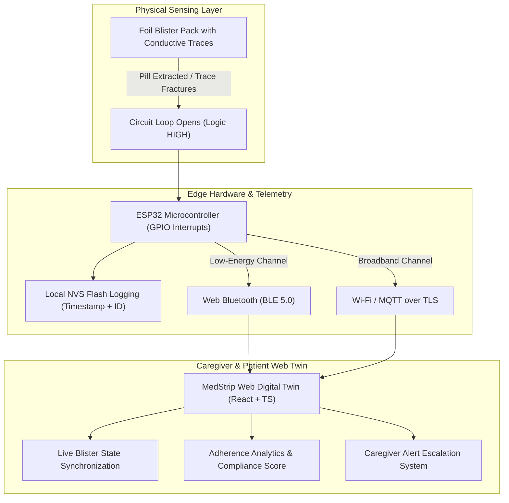

# MedStrip 💊📡
### Smart IoT Blister Packaging with Real-Time Adherence Tracking & Digital Twin Telemetry

[](https://vitejs.dev/)
[](https://react.dev/)
[](https://www.typescriptlang.org/)
[](https://tailwindcss.com/)
[](LICENSE)

---

## 📌 Overview

**MedStrip** is a non-invasive, cost-effective smart healthcare IoT system designed to eliminate medication non-adherence among elderly, chronic, and post-operative patients. 

Unlike bulky, expensive smart pillboxes ($100–$300) that require patients to manually decant loose pills from their factory seals, MedStrip converts standard pharmaceutical blister packaging into an intelligent digital twin. When a patient punches out a pill, an ultra-thin conductive trace breaks, triggering a hardware interrupt on an ESP32 microcontroller that logs the dose in real time via dual-channel Web Bluetooth (BLE) and Wi-Fi MQTT.

---

## 🚀 Key Features

* **⚡ Conductive Trace Fracture Sensing:** Zero-moving-parts detection. A micro-conductive loop covers each blister foil backing; punching through tears the trace, opening the circuit.
* **🌐 Web Bluetooth API Telemetry:** Direct browser-to-hardware telemetry without needing proprietary smartphone app store installations.
* **📱 Responsive Digital Twin Dashboard:** Interactive 2D/3D visual simulator that mirrors the physical blister pack state, showing which pill was taken, scheduled, or missed.
* **💾 Resilient Offline Storage (NVS):** Stores dose timestamps locally on ESP32 Non-Volatile Flash if Wi-Fi or Bluetooth is unavailable, auto-syncing upon reconnection.
* **⏰ Real-time Caregiver Alerts & Timelines:** Automated adherence percentage scoring, dose timelines, and escalation alerts for missed or double doses.
* **🔋 Ultra-Low Power Consumption:** ESP32 remains in deep sleep (~10–15 µA) and wakes up within milliseconds only when a trace fracture interrupt triggers.

---

## 🏗️ System Architecture



---

## 🛠️ Tech Stack

* **Frontend:** React 19, TypeScript, Vite, Tailwind CSS, Lucide React, Canvas Confetti
* **Edge / Embedded:** ESP32-WROOM-32, FreeRTOS, Arduino/ESP-IDF, Web Bluetooth GATT Profile
* **Protocols:** Web Bluetooth API (Web GATT), MQTT / WebSockets, JSON Telemetry payloads
* **Design & Twin Simulation:** SVG Micro-renderers, CSS Glassmorphic Dashboard, Dark/Light Telemetry Studio

---

## 📊 Presentation & Project Documentation

* 📑 **Review II Presentation:** `MedStrip_Review_II.pptx` (included in repository root)
* 📋 **Review II Milestones:** Architecture circuit design, hardware pinout, live digital twin web app, time synchronization, and responsive caregiver UI (~45% completion milestone achieved).

---

## ⚡ Getting Started Locally

### Prerequisites
* Node.js (v18.0.0 or higher)
* npm or yarn

### Installation
```bash
# Clone the repository
git clone https://github.com/AKHILESH2625/MedStrip.git

# Navigate into project directory
cd MedStrip

# Install dependencies
npm install

# Start local Vite development server
npm run dev
```

Visit `http://localhost:5173` in your browser.

---

## 👥 Project Team & Mentorship

* **Students:**
  * Kanishka Jayakumar (25BCE5136)
  * Raghav Krishna B (25BCE5195)
  * Ashwath S (25BCE5320)
* **Project Guide:** Dr. Palani Thanaraj K
* **Institution:** School of Computer Science and Engineering (SCOPE), Vellore Institute of Technology (VIT), Chennai, India.

---

## 📄 License
This project is open-source and distributed under the MIT License.
